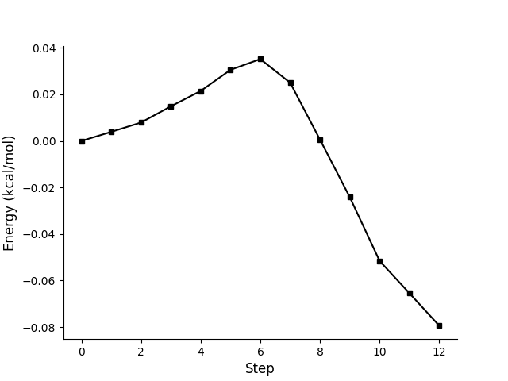

# readme

# pyMCD

## Requirements

- python>=3.7
- [numpy](https://github.com/numpy/numpy)
- [scipy](https://github.com/scipy/scipy)>=1.11.0
- [cclib](https://github.com/cclib/cclib)>=1.7.1 (If users want to use Gaussian …)
- [matplotlib](https://github.com/matplotlib/matplotlib) (If users want to obtain the figure of a profile)

## Settings

Before running pyMCD, you should well configure the `PYTHONPATH` and the QC software to run pyMCD. For the latter one, you should configure the path as:

```python
>> export PYTHONPATH=<git clone path>
```

Also, QC software should be directly executable with a specific command. For example, in the case of Gaussian 16, when you command ‘which g16', the path for g16 should be found as the following:

```python
>> which g16
>> /appl/Gaussian16/AVX_revB01/g16/g16
```

If the path is not found, you will see the following result:

```python
>> which g16
>> **no g16 in** (directories) # (No g16 is the key point)
```

## Input files

Users have to prepare three input files:

- R.com: Input for the geometry of reactants
- coordinates: Input for setting active coordinates
- qc_input: Input for Quantum Chemistry (QC) package
- options: Additional hyperparameters for pyMCD

Here, we show the example of input files in example/diels

### 1. R.com

The geometry of target molecule with `charge` and `spin multiplicity` is written:

```
0 1 # charge multiplicity
C 0.00000000 0.00000000 0.00000000 # 3D geometry of reactants of Diels alder reaction
C 0.03101500 0.00321900 1.33695700
C 1.25868100 0.00290300 2.13867800
C 2.49534700 -0.00205700 1.62972600
C 2.26606500 -2.42640100 0.45058000
C 1.15192300 -2.42622200 -0.27662600
H 0.17926100 -2.67118800 0.12875300
H 1.12996800 -2.20777400 -1.33507000
H 2.28637300 -2.67106300 1.50421500
H 3.24383300 -2.20776500 0.04480200
H 3.38321900 -0.04383300 2.24341300
H 2.71059800 0.07480700 0.57265500
H 1.10020000 -0.03373600 3.21984800
H -0.89519400 -0.03471900 1.91664600
H -0.91872700 -0.04169400 -0.56646200
H 0.88142600 0.07857400 -0.62177800
```

### 2. coordinates

Active coordinates in terms of internal coordinates are specified

```
1 6 1.54 6
4 5 1.54 6
```

Here, it scans the distance between C1 and C6 and the distance between C4 and C5. They are shrunk to 1.54 angstrom with 6 steps.

### 3. qc_input

Information containing theory level of calculations, basis set, solvation, and other detail options.

**For gaussian,**

```
#N pm6 scf(xqc)
```

**For Orca,**

```
! b3lyp 6-31g(d)
```

### 4. option

We feed hyperparameters of pyMCD as the following format:

```python
num_relaxation=7 # The maximum number of optimization steps, default=5
step_size=0.05 # The maximal displacement within an optimization step, default is set with optimized value
unit=Hartree # The energy unit for printing a log file. Available units are kcal, eV, Hartree. Default is Hartree
working_directory=<scratch directory> # A scratch directory for running QC package, default is the input directory
calculator= Gaussian # The name of QC package. Currently, Gaussian and Orac are available
command=g09 # The command for running QC package. (Same command you configured in 2. Settings)
use_hessian=0 # Whether to use the original version or the revised version of MCD
hessian_update=exact # Method for calculating the Hessian
reoptimize=1 # Whether to first optimize the given reactant geometry before running the MCD algorithm
```

This file is not necessary. If this file is not found, the code will automatically run with setting variables as default values.

## Executing pyMCD

You can run pyMCD with the following command:

```python
python run.py -id <input directory> -od <output directory>
```

Output files will be saved in the `output directory`. Default option is same with the `input directory`

**Example Code for diels-alder reaction TS search**

```
python run.py \
    -id example/diels \
    -od example/diels
```

## Output

Basically, five output files are created:

- output.log
- pathway.xyz
- ts.xyz
- profile.log
- profile.png (This is well created only when the matplotlib library is well installed)

Example output files after running pyMCD with the previous input are shown below:

### 1. output.log

A brief description and output logs of `pyMCD` are written.

```

###### Reactant information ######
charge: 0    multiplicity: 1
16
C 0.0 0.0 0.0
C 0.031015 0.003219 1.336957
C 1.258681 0.002903 2.138678
C 2.495347 -0.002057 1.629726
C 2.266065 -2.426401 0.45058
C 1.151923 -2.426222 -0.276626
H 0.179261 -2.671188 0.128753
H 1.129968 -2.207774 -1.33507
H 2.286373 -2.671063 1.504215
H 3.243833 -2.207765 0.044802
H 3.383219 -0.043833 2.243413
H 2.710598 0.074807 0.572655
H 1.1002 -0.033736 3.219848
H -0.895194 -0.034719 1.916646
H -0.918727 -0.041694 -0.566462
H 0.881426 0.078574 -0.621778

######### Scanning coordinates #########
(1, 6): 2.7 -> 1.54, -0.1933 angstrom per step
(4, 5): 2.7056 -> 1.54, -0.1943 angstrom per step
Step size is set to 0.1166 as the default value!!!

########## Scanning information ##########
num relaxation: 5
step size: 0.1166

##### Calculator information ######
Calculator: Gaussian
working_directory: /scratch/udg/
command: g16
Energy: Hartree

###### qc_input ######
#N pm6 scf(xqc)

Starting time: 2022-10-21 11:45:45.372045
Set up done!!!
Initialization, Relaxing ....
Relaxation finished! Start scanning ....
[2022-10-21 11:45:48.417] Progress (1/12):  (1, 6): 0/6 (4, 5): 1/6
[2022-10-21 11:46:02.254] 0.3921E-2 Hartree has Increased after 5 force calls! 0:00:15.312 Taken ...
[2022-10-21 11:46:03.746] Progress (2/12):  (1, 6): 1/6 (4, 5): 1/6
[2022-10-21 11:46:14.718] 0.4016E-2 Hartree has Increased after 5 force calls! 0:00:12.460 Taken ...
[2022-10-21 11:46:16.204] Progress (3/12):  (1, 6): 2/6 (4, 5): 1/6
...
[2022-10-21 11:48:10.626] Progress (12/12):  (1, 6): 6/6 (4, 5): 6/6
[2022-10-21 11:48:16.122] 0.1393E-1 Hartree has Decreased after 5 force calls! 0:00:05.497 Taken ...
[2022-10-21 11:48:16.126018] Scan completed ...
Total 60 force calls performed ...
End time: 2022-10-21 11:48:17.883163
Taken time: 0:02:32.511118

```

### 2. pathway.xyz

The geometries of the points along the pathway generated by `pyMCD` ant their electronic energies are written.

```
0
0.0776422942853723
C 0.0 0.0 0.0
C 0.031015 0.003219 1.336957
C 1.258681 0.002903 2.138678
C 2.495347 -0.002057 1.629726
C 2.266065 -2.426401 0.45058
C 1.151923 -2.426222 -0.276626
H 0.179261 -2.671188 0.128753
H 1.129968 -2.207774 -1.33507
H 2.286373 -2.671063 1.504215
H 3.243833 -2.207765 0.044802
H 3.383219 -0.043833 2.243413
H 2.710598 0.074807 0.572655
H 1.1002 -0.033736 3.219848
H -0.895194 -0.034719 1.916646
H -0.918727 -0.041694 -0.566462
H 0.881426 0.078574 -0.621778

...

12
-0.0018241595178008856
C 0.095939 -0.570428 -0.030593
C 0.107274 -0.044635 1.374394
C 1.244687 -0.017894 2.077553
C 2.507095 -0.551025 1.466278
C 2.22822 -1.860973 0.706101
C 1.004303 -1.798535 -0.226117
H 0.401402 -2.715241 -0.075825
H 1.340158 -1.827626 -1.279694
H 2.074158 -2.669841 1.447624
H 3.124858 -2.144978 0.125054
H 3.283953 -0.721542 2.233865
H 2.922535 0.206876 0.769674
H 1.311118 0.367402 3.088442
H -0.839231 0.316348 1.763824
H -0.934544 -0.820205 -0.34714
H 0.43206 0.245347 -0.707103
```

### 3. profile.log

The electronic energies of the points along the pathway are written. The first column shows the original energy with the energy unit specified in the ‘option’ file. The second column shows the relative energy with respect to reactants with kcal/mol.

```
Original Energy (Hartree/mol)    Relative Energy (kcal/mol)
0.0776422942853723   0.0
0.0815632928108389   2.460463722517743
0.08557910769066236      4.980425605690531
0.09257505477825809      9.370448683201001
0.09915399868185863      13.498798312040018
0.10824465842889286      19.20327342878806
0.11283916423722741      22.08636935215593
0.10272448736475942      15.739313787595341
0.07821446750017079      0.35904411309119594
0.05336164001392209      -15.236340591785684
0.02604045476074957      -32.380643180784496
0.012102670988113632     -41.12673454555648
-0.0018241595178008856   -49.86595263168884
Maxima point: 6
```

### 4. profile.png

Figure of profile using relative energy as y-axis.



### 5. ts.xyz

The geometry of the maximum point of the pathway and its electronic energy.

```
16
0.11283916423722741
C 0.118648 -0.215641 -0.044401
C 0.067769 -0.053241 1.321442
C 1.252311 -0.059302 2.09557
C 2.484097 -0.21923 1.503589
C 2.202348 -2.117006 0.595079
C 1.045665 -2.119159 -0.152426
H 0.14 -2.577299 0.225919
H 1.078937 -2.023226 -1.230977
H 2.233934 -2.570386 1.579193
H 3.172997 -2.011822 0.12569
H 3.373477 -0.385348 2.095592
H 2.696236 0.157142 0.506919
H 1.157129 -0.10527 3.180968
H -0.887984 -0.089442 1.843352
H -0.783879 -0.365275 -0.622262
H 0.952301 0.147552 -0.636911
```

## Implementation of Calculator

View the following page: [Implementation instruction](subpage/details.md)

## Citation

Please cite as below
Lee, Kyunghoon, Jun Hyeong Kim, and Woo Youn Kim. "pyMCD: Python package for searching transition states via the multicoordinate driven method." Computer Physics Communications 291 (2023): 108831.

## License

The code is under BSD-3-license

## Contact Information

Please e-mail me to here: kyunghoonlee@kaist.ac.kr

